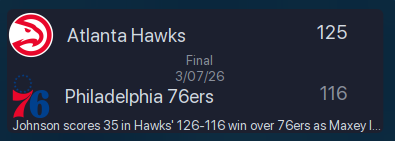
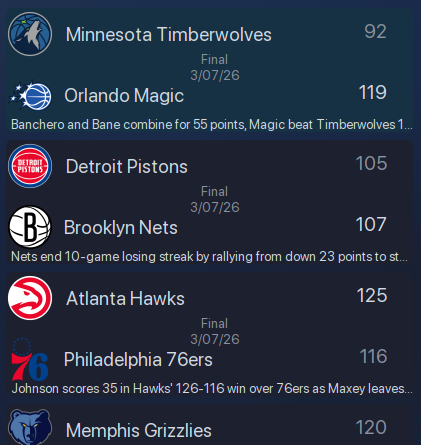

# scoreBoard
* KDE Plasma 6 SKoreboard Widget
* Get Sports Scores for MLB,NBA,NFL,NHL,MLS,WNBA,World Cup

#### Compact View
 
 
#### Full View
 
 

* Install with
 ``` bash
git clone https://github.com/TxHammer68/scoreBoard /tmp/scoreBoard && kpackagetool6 -t Plasma/Applet -i /tmp/skoreboard/
```
* Upgrade with
``` bash
git clone https://github.com/TxHammer68/scoreBoard /tmp/scoreBoard && kpackagetool6 -t Plasma/Applet -u /tmp/skoreBoard
```
* Remove with
``` bash
kpackagetool6 --remove /tmp/scoreBoard --type Plasma/Applet
```
* Install widget to panel or desktop floating
* Right click on widget to configure
* Select Sport Type
* Select View

#### Notes
* update interval is dynamic; 5 minutes when any game is active, 30 minutes if no games
* compact view is ideal for desktop floating widget, there is an animation that cycles thru all the games
* full view is scrollable with mouse wheel
* left click on any game to view more details on the web
* middle click on any game to refresh data
* When system wakes from suspend/sleep mode, widget will refresh after network connection is established
* You can resize popup to get proper fit
* Add multiple scoreboards for different sport types
* Added Update Widget Button in the Config Screen
    * Automatically checks for updates on first load and wake from sleep mode
    * Widget will send a system notification message when update is available
    * Check settings to download/apply update
    * Logout after update for update to be applied
    * Verify settings/config after login

All trademarks, trade names, or logos mentioned or used are the property of their respective owners. Every effort has been made to properly capitalize, punctuate, identify and attribute trademarks and trade names to their respective owners.
